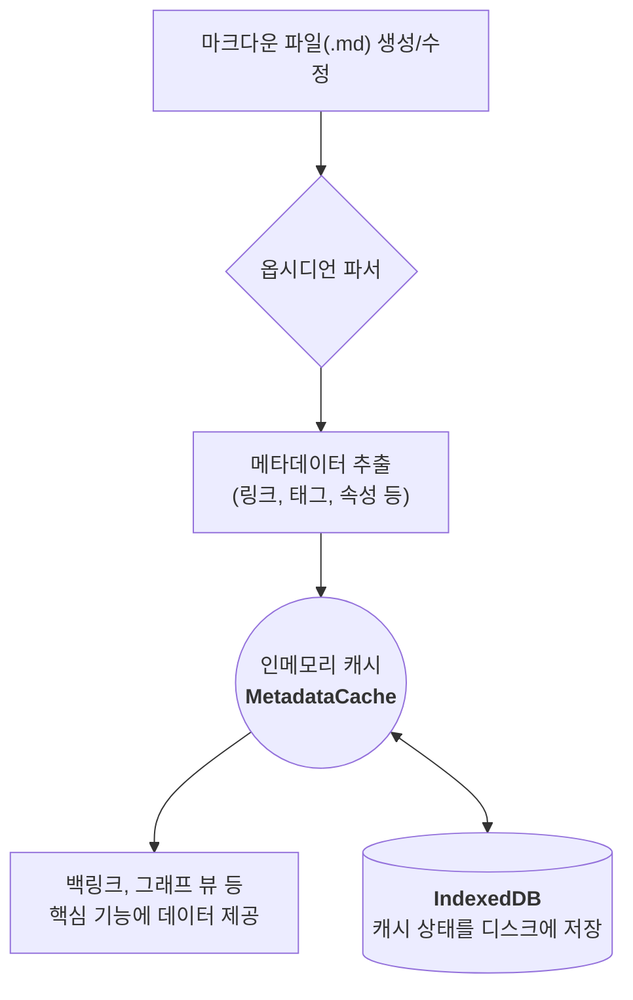
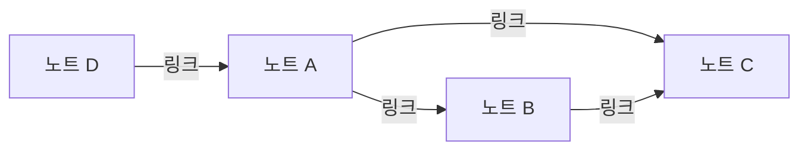

옵시디언(Obsidian)을 사용하다 보면 마치 마법처럼 느껴지는 순간이 있습니다. 그저 평범한 텍스트 파일에 `[[다른 노트 제목]]` 이라는 대괄호 두 개를 추가했을 뿐인데, 노트 간에 선이 연결되고, 어떤 노트가 나를 참조하는지(백링크) 목록이 나타나며, 거대한 지식의 지도(그래프 뷰)가 그려지기 시작합니다.

파일 시스템에는 이런 ‘연결’ 정보를 저장하는 기능이 없습니다. 그렇다면 옵시디언은 어떻게 이 모든 관계를 기억하고 관리하는 것일까요? 이 글에서는 옵시디언 링크 기능의 핵심 동작 원리를 시각적인 다이어그램과 함께 쉽고 깊이 있게 파헤쳐 봅니다.

## 1. 옵시디언의 '내부 기억 장치': 메타데이터 캐시

결론부터 말하면, 옵시디언의 마법은 **‘메타데이터 캐시(Metadata Cache)’** 라는 정교한 인덱싱 시스템 덕분입니다. 옵시디언은 노트의 원본 텍스트는 그대로 유지한 채, 파일들의 모든 부가 정보(메타데이터)를 별도의 '기록부'에 저장하고 이를 활용합니다.

### 1.1. **핵심 원리: 모든 것은 인덱싱된다**

옵시디언은 사용자가 볼트(Vault)를 열거나 노트를 수정할 때마다, 내장된 파서(Parser)를 통해 모든 파일을 빠르게 스캔합니다. 이 과정에서 노트의 내용이 아닌, 다음과 같은 **메타데이터**를 추출하여 캐시에 저장합니다.

-   **내부 링크**: 어떤 노트가 다른 노트를 가리키는지 (`[[...]]`)
-   **태그**: `#tag` 형식의 모든 태그
-   **속성(Properties)**: 파일 상단에 YAML 형식으로 정의된 모든 정보 (예: `author: 고리타`)

이렇게 만들어진 캐시는 **인메모리(in-memory)**, 즉 프로그램의 메모리 위에서 작동하기 때문에 매우 빠른 속도로 데이터 조회가 가능합니다. **백링크, 그래프 뷰, 태그 목록** 등 옵시디언의 거의 모든 기능은 바로 이 캐시를 실시간으로 조회하여 사용자에게 보여주는 것입니다.

### 1.2. **인덱싱 과정 시각화**

옵시디언의 전체 인덱싱 흐름을 다이어그램으로 표현하면 다음과 같습니다. 사용자가 파일을 수정하는 순간부터 캐시가 업데이트되고 기능에 반영되기까지의 과정을 한눈에 볼 수 있습니다.

### 1.3. **물리적 저장소: `.obsidian` 폴더와 `IndexedDB`**

이 '내부 기억 장치'는 눈에 보이지 않는 개념이 아니라 물리적으로 사용자의 컴퓨터에 저장됩니다.

-   **`.obsidian` 폴더**: 각 볼트 최상단에 있는 이 숨김 폴더는 플러그인, 테마 설정과 함께 캐시의 일부 상태를 저장하여 볼트의 환경을 구성합니다.
-   **`IndexedDB`**: 옵시디언은 웹 기술(Electron)을 기반으로 만들어졌기 때문에, 브라우저의 내장 데이터베이스인 `IndexedDB`를 활용하여 메타데이터 캐시를 디스크에 효율적으로 저장하고 관리합니다. 이를 통해 앱을 껐다 켜도 인덱싱 정보를 그대로 유지할 수 있습니다.

결국 옵시디언은 **"파일은 파일대로, 메타데이터는 데이터베이스대로"** 관리하는 영리한 하이브리드 아키텍처를 채택한 것입니다.

## 2. 인덱스를 활용하는 핵심 기능들

이렇게 구축된 링크 인덱스는 옵시디언의 핵심 기능들을 떠받치는 기둥 역할을 합니다.

### 2.1. **백링크 (Backlinks): 관계의 역추적**

현재 노트를 어떤 다른 노트들이 링크하고 있는지 보여주는 **백링크** 기능은 캐시를 활용하는 가장 대표적인 예입니다. 옵시디언은 모든 파일의 링크 정보를 `MetadataCache`에 기록해두었기 때문에, 특정 노트(예: '노트 A')를 목적지로 하는 링크가 어떤 파일에 있는지 실시간으로 쿼리하여 목록을 보여줄 수 있습니다.

### 2.2. **그래프 뷰 (Graph View): 지식의 시각화**

아름다운 **그래프 뷰** 역시 캐시에 저장된 링크 인덱스의 시각적 표현일 뿐입니다. 각 노트는 그래프의 '점(노드)'이 되고, 노트 간의 `[[링크]]`는 '선(엣지)'이 되어 연결 관계를 그려냅니다. 어떤 노트가 많은 링크를 받을수록 그래프에서 더 큰 원으로 표시되어, 지식 네트워크의 중심점을 시각적으로 파악하게 해줍니다.

### 2.3. **그래프 뷰 예시**

예를 들어, 다음과 같이 노트들이 연결되어 있다면 그래프 뷰는 아래와 같이 그려집니다.

### 2.4. **연결되지 않은 언급 (Unlinked Mentions): 숨겨진 관계 찾기**

백링크 패널의 **'연결되지 않은 언급'** 기능 또한 인덱싱 덕분에 가능합니다. 옵시디언은 `[[...]]`로 명시적으로 링크되지 않았더라도, 현재 노트의 제목과 동일한 텍스트가 다른 노트에 나타나는 경우를 모두 찾아 제시합니다. 이를 통해 우리는 미처 생각지 못했던 노트 간의 연결고리를 발견하고 지식을 확장할 수 있습니다.

## 3. 주의할 점: 확장성

이러한 인덱싱 방식은 매우 효율적이지만, 볼트의 크기가 매우 커지면(수만 개의 노트), 앱 시작 시 모든 파일을 스캔하고 캐시를 구축하는 데 시간이 걸릴 수 있습니다. 이는 아키텍처의 결함이라기보다는, 모든 것을 로컬에서 직접 처리하는 방식의 자연스러운 트레이드오프입니다. 하지만 대부분의 사용자에게는 그 장점이 단점을 압도합니다.

## 결론

처음 옵시디언의 링크 기능을 접했을 때는 정말 마법처럼 느껴졌습니다. 하지만 이번 리서치를 통해 그 '마법'이 실제로는 **‘메타데이터 캐시’** 와 **‘인덱싱’** 이라는 잘 설계된 기술적 원리 덕분이라는 사실을 알게 되어 매우 흥미로웠습니다.

단순한 파일과 폴더 구조 위에서 어떻게 그토록 유기적인 네트워크가 만들어질 수 있는지에 대한 궁금증이 해소되는 과정이었습니다. 결국 옵시디언의 핵심은 사용자의 데이터를 존중하는 로컬 우선(local-first) 철학을 지키면서도, 그 한계를 기술적으로 영리하게 풀어냈다는 점이었습니다. 복잡한 현상 뒤에 숨은 명쾌한 원리를 발견하는 즐거운 탐구 과정이었습니다.

---
### 참고 자료
1. [How Obsidian stores data - Obsidian Help](https://help.obsidian.md/data-storage)
2. [MetadataCache - Developer Documentation](https://docs.obsidian.md/Reference/TypeScript+API/MetadataCache)
3. [메모 앱 시장 뒤흔든 '옵시디언' 장단점 파헤치기 - 요즘IT](https://yozm.wishket.com/magazine/detail/2518/)
4. [Backlinks - Obsidian Help](https://help.obsidian.md/plugins/backlinks)
5. [그래프 뷰 - Obsidian Help](https://publish.obsidian.md/help-ko/%ED%94%8C%EB%9F%AC%EA%B7%B8%EC%9D%B8/%EA%B7%B8%EB%9E%98%ED%94%84+%EB%B7%B0)
